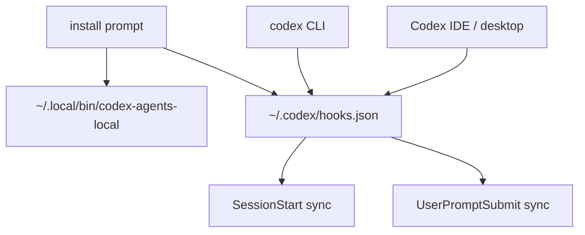

# codex-agents-local

`AGENTS.local.md` support for Codex, without changing the official `codex` command or Codex IDE/desktop launch path.

## Install

```text
Read https://github.com/samzong/codex-agents-local/blob/main/INSTALL_PROMPT.md

Follow that prompt in your Codex to install without changing your existing `codex` entry point.
```

## How It Works

- Put shared repo instructions in `AGENTS.md`.
- Put private local instructions in `AGENTS.local.md`.
- This tool generates `AGENTS.override.md` in the same directory when `AGENTS.local.md` exists.
- If an existing `AGENTS.override.md` was not generated by this tool, it is left untouched and a warning is emitted.

After installation, keep using Codex normally:

```sh
codex .
```



The installer enables `SessionStart` and `UserPromptSubmit` hooks in `~/.codex/hooks.json`, so startup context and later `AGENTS.local.md` edits can both be synced into the current session.

## Commands

```sh
codex-agents-local doctor
codex-agents-local sync --cwd .
codex-agents-local sync --cwd . --json
codex-agents-local install --hooks
make audit
```

## Keep Out Of Git

Add these to your global gitignore or repo gitignore:

```gitignore
AGENTS.local.md
AGENTS.override.md
```

## Security

Run the audit gate before publishing changes:

```sh
make audit
```

See [SECURITY.md](SECURITY.md) for the full security boundary.
