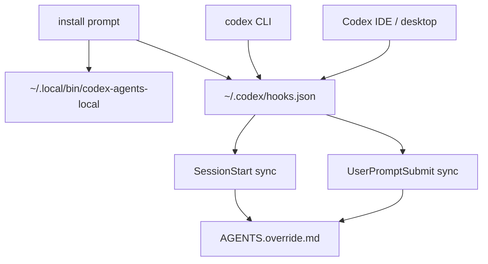

# codex-agents-local

Add local-only `AGENTS.local.md` instructions to Codex without replacing, wrapping, aliasing, or moving the official `codex` command.

[Chinese README](README.zh-CN.md)

## Why

Codex already gives repos a shared instruction file: `AGENTS.md`.

That works for team rules, but not for machine-local preferences, private paths, local tool habits, or personal workflow constraints that should never be committed.

`codex-agents-local` keeps that split explicit:

- `AGENTS.md` stays shared and tracked.
- `AGENTS.local.md` stays private and ignored.
- `AGENTS.override.md` is generated locally when a directory has `AGENTS.local.md`.
- Codex CLI and Codex IDE/desktop keep their normal launch path.

## Install

Recommended install path: ask Codex to inspect and run the installer for you.

```text
Read https://github.com/samzong/codex-agents-local/blob/main/INSTALL_PROMPT.md

Follow that prompt in Codex to install codex-agents-local.
```

The default installer:

- installs `codex-agents-local` into `~/.local/bin`
- updates `~/.codex/hooks.json`
- enables `SessionStart` and `UserPromptSubmit` hooks
- does not enable `PreToolUse`
- does not change your existing `codex` command

## Example

Shared repo instructions:

```md
# AGENTS.md

Run the project test command before claiming a fix is done.
```

Private local instructions:

```md
# AGENTS.local.md

Use my local cache path for expensive checks.
```

Generated local override:

```text
AGENTS.override.md
```

Add the local files to your global gitignore or repo gitignore:

```gitignore
AGENTS.local.md
AGENTS.override.md
```

## How It Works



`SessionStart` syncs local instructions when a Codex session starts.

`UserPromptSubmit` syncs later `AGENTS.local.md` edits the next time you send a message.

Deleting `AGENTS.local.md` removes its managed `AGENTS.override.md` on the next sync. Existing sessions receive a notice to discard the removed local instructions. `sync --check` previews the removal without changing files. Unmanaged overrides and symlinks remain untouched.

`PreToolUse` is available for stronger long-session sync, but it is not installed by default.

## Commands

```sh
codex-agents-local doctor
codex-agents-local sync --cwd .
codex-agents-local sync --cwd . --check
codex-agents-local sync --cwd . --json
codex-agents-local install --hooks
codex-agents-local install --hooks --pre-tool-use
make audit
```

## Safety

`codex-agents-local` is a local Codex hook helper. Its boundary is intentionally narrow:

- it does not execute repository files
- it does not use `eval`, `source`, `sh -c`, `bash -c`, `sudo`, or `shell=True`
- it does not replace, wrap, alias, or move the official `codex` command
- it does not overwrite an unmanaged `AGENTS.override.md`
- it does not intentionally read or write secrets
- it does not send workspace contents to a network service

See [SECURITY.md](SECURITY.md) for the full security boundary.

## Requirements

Runtime:

- Codex with hooks support
- Python 3
- Git

Audit:

- `shellcheck`
- `rg`
- `python3`
- `git`

Run the audit gate before publishing changes:

```sh
make audit
```
