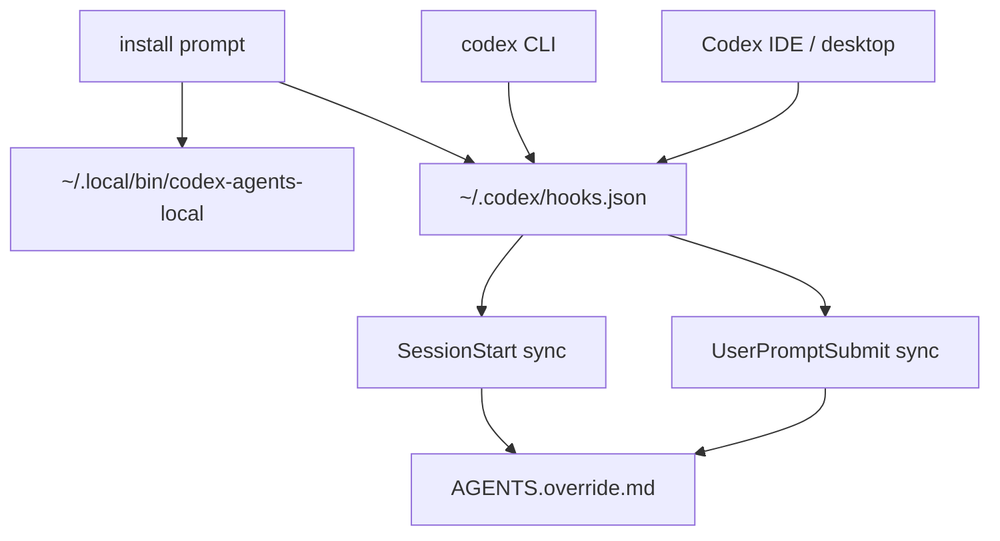

# codex-agents-local

给 Codex 增加本地私有的 `AGENTS.local.md` 规则支持，同时不替换、不包装、不 alias、不移动官方 `codex` 命令。

## 为什么需要

Codex 已经支持 repo 里的共享规则文件：`AGENTS.md`。

但很多规则只属于本机：私人路径、本地工具习惯、token 优化、临时约束、个人工作流偏好。这些内容不应该提交到 Git，也不应该污染团队规则。

`codex-agents-local` 把边界拆清楚：

- `AGENTS.md` 是共享规则，可以进 Git。
- `AGENTS.local.md` 是本机私有规则，应该 ignore。
- `AGENTS.override.md` 是本工具生成的本地合并结果。
- Codex CLI 和 Codex IDE/desktop 继续用原来的启动方式。

## 安装

推荐安装方式：让 Codex 先审查安装步骤，再执行安装。

```text
Read https://github.com/samzong/codex-agents-local/blob/main/INSTALL_PROMPT.md

Follow that prompt in Codex to install codex-agents-local.
```

默认安装会：

- 安装 `codex-agents-local` 到 `~/.local/bin`
- 更新 `~/.codex/hooks.json`
- 启用 `SessionStart` 和 `UserPromptSubmit` hooks
- 不启用 `PreToolUse`
- 不改动现有 `codex` 命令

## 例子

repo 共享规则：

```md
# AGENTS.md

Run the project test command before claiming a fix is done.
```

本机私有规则：

```md
# AGENTS.local.md

Use my local cache path for expensive checks.
```

本工具会生成：

```text
AGENTS.override.md
```

建议加入全局 gitignore 或项目 gitignore：

```gitignore
AGENTS.local.md
AGENTS.override.md
```

## 工作方式



`SessionStart` 会在 Codex 会话启动时同步本地规则。

`UserPromptSubmit` 会在你下一次发送消息时同步后续修改过的 `AGENTS.local.md`。

`PreToolUse` 可以提供更强的长会话同步，但默认不安装。

## 常用命令

```sh
codex-agents-local doctor
codex-agents-local sync --cwd .
codex-agents-local sync --cwd . --check
codex-agents-local sync --cwd . --json
codex-agents-local install --hooks
codex-agents-local install --hooks --pre-tool-use
make audit
```

## 安全边界

`codex-agents-local` 是本地 Codex hook helper，边界很窄：

- 不执行 repo 里的文件
- 不使用 `eval`、`source`、`sh -c`、`bash -c`、`sudo` 或 `shell=True`
- 不替换、包装、alias 或移动官方 `codex` 命令
- 不覆盖手写的 `AGENTS.override.md`
- 不主动读取或写入 secrets
- 不把 workspace 内容发送到网络服务

完整边界见 [SECURITY.md](SECURITY.md)。

## 依赖

运行需要：

- 支持 hooks 的 Codex
- Python 3
- Git

发布检查还需要：

- `shellcheck`
- `rg`
- `python3`
- `git`

发布前运行：

```sh
make audit
```
